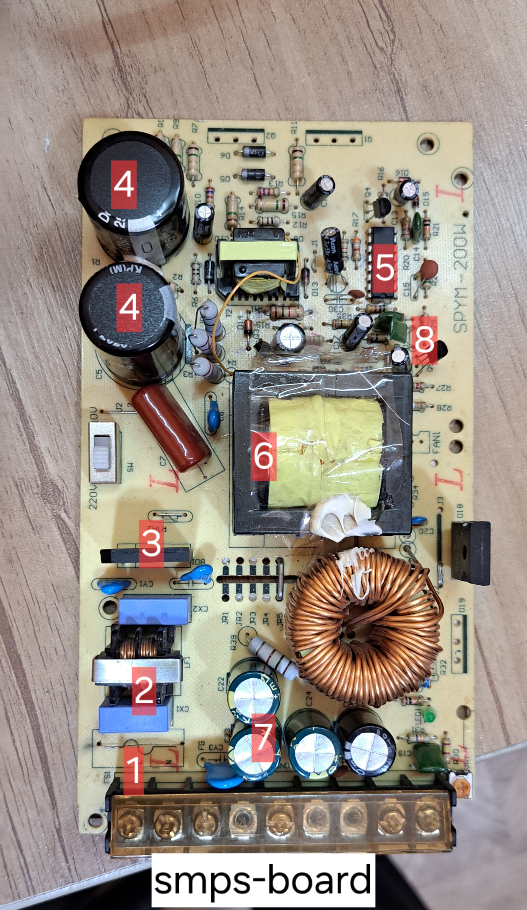

# SMPS Repair Guide

A comprehensive guide to troubleshooting, diagnosing, and repairing Switch Mode Power Supplies (SMPS).

This repository is designed for electronics technicians, students, and repair professionals who want to understand how SMPS circuits work, identify common failures, and perform safe and effective repairs.

---

## Table of Contents

- Introduction
- What Is an SMPS?
- How an SMPS Works
- Main Components
- Common Failures
- Troubleshooting Procedure
- Repair Tools
- Safety Precautions
- Frequently Asked Questions
- References

## Introduction

Switch Mode Power Supplies (SMPS) are widely used in televisions, computers, industrial equipment, LED drivers, communication systems, home appliances, and many other electronic devices. Compared with traditional linear power supplies, SMPS units provide higher efficiency, lower heat generation, reduced weight, and compact size.

Despite these advantages, SMPS circuits are often considered difficult to repair because multiple sections of the circuit work together. A failure in one component may cause abnormal behavior in another section, making accurate troubleshooting essential.

This guide introduces the basic operating principles of SMPS circuits, explains the function of the main components, and describes practical troubleshooting methods used by electronics technicians. The goal is to help readers understand the repair process in a logical and systematic way rather than replacing components by trial and error.

## What Is an SMPS?

A Switch Mode Power Supply (SMPS) is an electronic power converter that transfers electrical energy by switching semiconductor devices at high frequency. The incoming AC voltage is rectified, filtered, switched at high speed, transferred through a high-frequency transformer, and finally regulated to produce stable DC output voltages.

Because switching occurs at frequencies much higher than the mains frequency, transformers and filtering components can be significantly smaller than those used in linear power supplies.

Today, SMPS technology is found in almost every modern electronic device.
## Example SMPS Board

## Typical Applications

| Device | Uses SMPS |
|---------|-----------|
| LED TV | ✅ |
| Computer | ✅ |
| Laptop Charger | ✅ |
| Industrial Controller | ✅ |
| Medical Equipment | ✅ |
| Air Conditioner | ✅ |
| Refrigerator | ✅ |

## Main Components

Most SMPS circuits contain the following sections:

- Input Fuse
- EMI Filter
- Bridge Rectifier
- Bulk Capacitor
- Power MOSFET
- PWM Controller IC
- High Frequency Transformer
- Optocoupler
- Feedback Circuit
- Output Rectifier
- Output Filter Capacitors

## Common SMPS Failures

The following faults are among the most common problems encountered in switch mode power supplies.

| Fault | Possible Cause |
|-------|----------------|
| No Output Voltage | Blown fuse, bridge rectifier failure, startup resistor |
| Fuse Blows Immediately | Shorted MOSFET or bridge rectifier |
| Low Output Voltage | Dried electrolytic capacitors |
| Intermittent Operation | Poor solder joints or bad capacitors |
| Clicking Sound | Overload or startup failure |
| Output Ripple | High ESR output capacitors |
| Power Cycling | Feedback circuit instability |

## Required Repair Tools

Professional SMPS repair normally requires the following tools:

- Digital Multimeter
- ESR Meter
- Oscilloscope
- Isolation Transformer
- Soldering Station
- Hot Air Rework Station
- DC Power Supply
- Magnifying Lamp

- ## Safety Precautions

⚠️ High-voltage capacitors inside SMPS circuits may remain charged even after disconnecting the AC power source.

Always discharge capacitors safely before troubleshooting.

Never perform live measurements unless you fully understand the associated electrical hazards.
